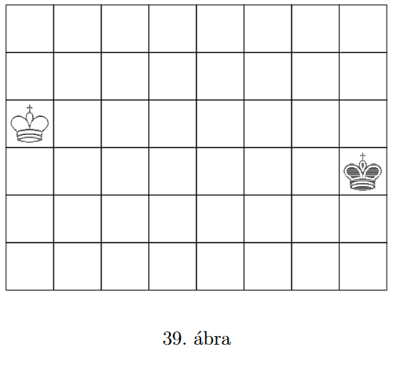

# Chess Kings BR
## Ez a projekt eredetileg a Szoftverfejlesztés nevű tárgyamra készült, GitHub Classroomról lett crosspostolva ide.
### 2.14 feladat implementációja

A 39. ábrán egy olyan 6 × 8 mezőből álló játéktábla látható,  
amelyre az egyik játékosnak egy világos, a másiknak egy sötét király sakkfigurát helyeztünk.  
A játékosok felváltva következnek lépni.  
Egy lépésben a figurát valamelyik nyolcszomszédos üres mezőre kell elmozdítani,  
majd pedig el kell távolítani a tábla valamelyik üres mezőjét (értelemszerűen a továbbiakban nem lehet eltávolított mezőre lépni).  
Az a játékos nyer, aki utoljára tud lépni.

### Kétszemélyes logikai játék

A játék modelljének elkészítéséhez felhasználtam  
homework-project-utils könyvtár game.BasicState alinterfészét valamint a State interfészt.

## An example game

1. PLAYER_1 (2,1)
1. PLAYER_2 (3,6)
1. PLAYER_1 (2,2)
1. PLAYER_2 (3,5)
1. PLAYER_1 (2,3)
1. PLAYER_2 (2,5)
1. PLAYER_1 (1,4)
1. PLAYER_2 (1,6)
1. PLAYER_1 (0,5)
1. PLAYER_2 (0,6)
1. PLAYER_1 (1,6)
1. PLAYER_2 (1,7)
1. PLAYER_1 (0,7)
1. PLAYER_2 (0,6)
1. PLAYER_1 (1,6)
1. PLAYER_2 (1,7)
1. PLAYER_1 (0,7)
1. PLAYER_2 (0,6)
1. PLAYER_1 (1,6)
1. PLAYER_2 (0,7)
1. PLAYER_1 (0,6)
1. PLAYER_2 (1,6)
1. PLAYER_1 (0,7)
1. PLAYER_2 (0,6)
1. PLAYER_1 (1,6)
1. PLAYER_2 (0,7)
1. PLAYER_1 (2,5)
1. PLAYER_2 (1,6)
1. PLAYER_1 (1,4)
1. PLAYER_2 (0,7)
1. PLAYER_1 (2,5)

PLAYER_1 wins

#### Készítette: Szarvas Péter
